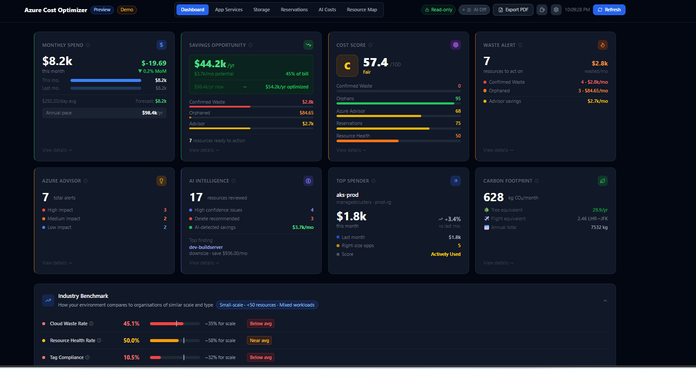
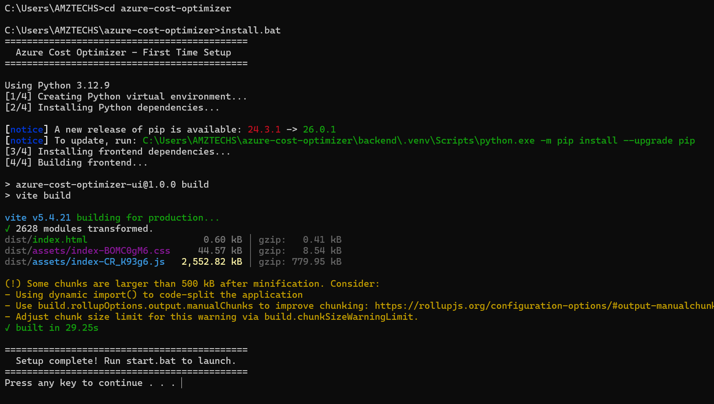
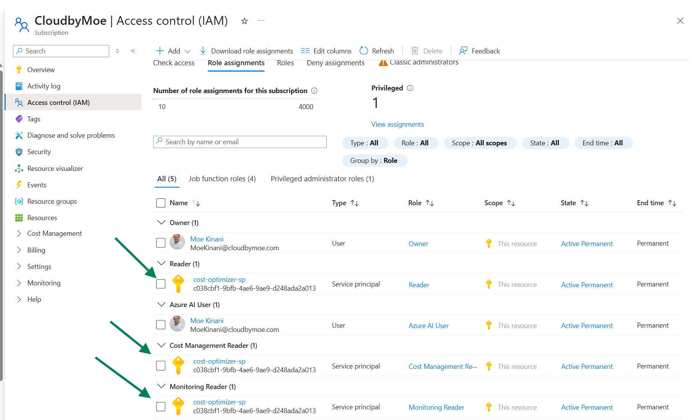
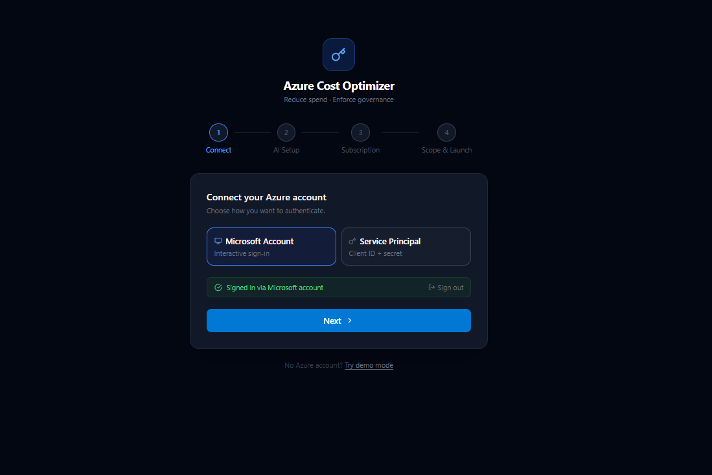
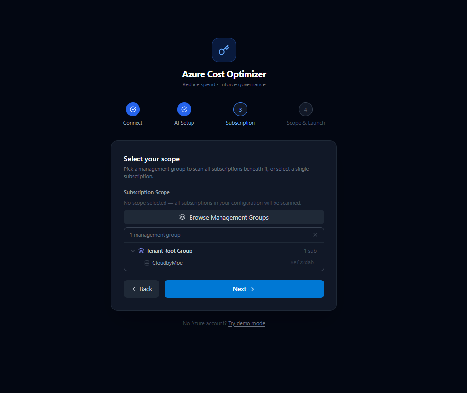

# Azure Cost Optimizer

[](LICENSE)
[](https://github.com/MoeKinani/azure-cost-optimizer)
[](https://buymeacoffee.com/moekinani)

**Find out exactly where your Azure money is going — in under 5 minutes, for free.**

No SaaS subscription. No data leaving your environment. No cost.

> Trusted by 600+ Azure admins in its first two weeks.

---



---

## Quick start

```bat
git clone https://github.com/MoeKinani/azure-cost-optimizer.git
cd azure-cost-optimizer
install.bat
start.bat
```

That's it. Your browser opens at `http://localhost:8000`. The setup wizard connects you to Azure in under 5 minutes.

> No Azure account yet? The tool includes a **demo mode** with real-looking data — no credentials needed.

---

## What it finds

Real numbers from a real environment — this is what a typical scan surfaces:

| Finding | Example |
|---------|---------|
| 💸 Savings opportunity | **$44.2k/yr** (45% of the bill) |
| 🗑️ Confirmed waste | $2.8k/mo in resources with near-zero activity |
| 🤖 AI-detected savings | $3.7k/mo flagged by AI scoring |
| 📋 Azure Advisor alerts | 7 recommendations, 3 high impact |
| 🌍 Carbon footprint | 628 kg CO₂/month with reduction paths |

---

## Why this exists

Enterprise Azure cost tools are expensive and require you to hand your billing data to a third party. This tool runs locally with a read-only service principal — your data never leaves your environment, and you pay nothing.

## Key features

- 🔍 **0-100 resource scoring** based on real Azure Monitor metrics — CPU, memory, network, storage, AI tokens
- 🔑 **Two auth options** — sign in with your Microsoft Account interactively, or use a Service Principal for unattended access
- 🌳 **Root Management Group support** — browse your full MG hierarchy and scan all subscriptions beneath any group in one pass
- 🤖 **AI-assisted scoring** — connect Azure OpenAI to get plain-English explanations and catch false positives
- 🧹 **Orphan detection** — unattached disks, unused public IPs, deallocated VMs, empty App Service Plans
- 📈 **3 months of billing history** — sustained cost trends flagged before they become a problem
- 📊 **Industry benchmarking** — see how your waste rate, resource health, and tag compliance compare to similar environments
- 🌍 **Carbon footprint tracking** — CO₂ estimates with tree and flight equivalents
- 📄 **PDF export** — shareable reports for stakeholder and board reviews
- 🔒 **No telemetry** — read-only roles, no write access, no data sent anywhere. AI features are optional; when enabled, resource metadata is sent to your Azure OpenAI instance

---

## Setup

### Step 1 — Install prerequisites

| Tool | Download | Notes |
|------|----------|-------|
| **Python 3.12** | [python.org/downloads](https://www.python.org/downloads/) | Tick **"Add Python to PATH"** during install. Do not use 3.13 or 3.14. |
| **Node.js 18+** | [nodejs.org](https://nodejs.org) | LTS version |
| **Git** | [git-scm.com](https://git-scm.com) | Accept all defaults |
| **Azure CLI** | [aka.ms/installazurecliwindows](https://aka.ms/installazurecliwindows) | Needed to create the service principal |

After installing, open a new Command Prompt and verify:

```
python --version
node --version
git --version
az --version
```

### Step 2 — Download and install

```bat
git clone https://github.com/MoeKinani/azure-cost-optimizer.git
cd azure-cost-optimizer
install.bat
```

`install.bat` creates a Python virtual environment, installs all dependencies, and builds the frontend. Takes 2-3 minutes. Run once.



### Step 3 — Create a service principal (if using SP auth)

Skip this step if you plan to sign in interactively with your Microsoft Account.

Log in to Azure CLI:

```bat
az login
```

Create a read-only service principal:

```bat
az ad sp create-for-rbac --name "cost-optimizer-sp" --role "Reader" --scopes "/subscriptions/YOUR_SUBSCRIPTION_ID"
```

Save the `appId`, `password`, and `tenant` values from the output.

### Step 4 — Assign required roles

Replace `YOUR_APP_ID`, `YOUR_SUBSCRIPTION_ID`, and `YOUR_MG_ID` with your values. `YOUR_MG_ID` is the Root Management Group ID found in Azure Portal under Management Groups.

```bat
az role assignment create --assignee YOUR_APP_ID --role "Reader" --scope "/providers/Microsoft.Management/managementGroups/YOUR_MG_ID"
az role assignment create --assignee YOUR_APP_ID --role "Cost Management Reader" --scope "/providers/Microsoft.Management/managementGroups/YOUR_MG_ID"
az role assignment create --assignee YOUR_APP_ID --role "Monitoring Reader" --scope "/subscriptions/YOUR_SUBSCRIPTION_ID"
az role assignment create --assignee YOUR_APP_ID --role "Management Group Reader" --scope "/providers/Microsoft.Management/managementGroups/YOUR_MG_ID"
```

Wait 2-5 minutes for roles to propagate before launching.

| Role | Scope | Purpose |
|------|-------|---------|
| Reader | Management Group | List all resources across subscriptions |
| Cost Management Reader | Management Group | Pull billing and cost data |
| Monitoring Reader | Subscription | Read CPU, memory, and usage metrics |
| Management Group Reader | Management Group | Required to pass the scope picker in the setup wizard |

> **Management Group Reader is required.** Without it the setup wizard cannot load your subscription list and you will not be able to complete configuration.



### Step 5 — Launch

```bat
start.bat
```

Your browser opens at `http://localhost:8000`. The setup wizard connects you to Azure in minutes.

---

## Setup wizard

### Connect your Azure account

Sign in interactively with your **Microsoft Account** (no app registration needed), or enter **Service Principal** credentials for unattended or automated use. Both paths are fully supported and can be switched at any time.



### Select your scope

Browse your **Root Management Group** hierarchy and pick any group to scan all subscriptions beneath it in one pass — no need to add subscriptions one by one.

> **Management Group Reader is required** to reach this step. If the role is not assigned the scope picker will not load and setup cannot proceed. See Step 4 above for how to assign it.



---

## Dashboard tabs

| Tab | What it shows |
|-----|--------------|
| **Dashboard** | KPI cards, score distribution, cost trends, resource table, orphans, savings |
| **App Services** | Plans, web apps, function apps with right-size recommendations and idle detection |
| **Storage** | Storage accounts with access patterns, lifecycle policies, and last-access tracking |
| **Reservations** | Reserved Instance coverage, utilisation rates, and right-sizing recommendations |
| **AI Costs** | Azure OpenAI and AI Foundry token usage, per-deployment breakdown |
| **Resource Map** | Visual map of all resources grouped by resource group |

---

## Scoring

Each resource receives a 0-100 optimisation score based on real Azure Monitor metrics over 30 days.

| Score | Label | Meaning |
|-------|-------|---------|
| 76-100 | **Fully Used** | Well utilised, no action needed |
| 51-75 | **Actively Used** | In use — consider reserved pricing |
| 26-50 | **Likely Waste** | Low activity — review and right-size |
| 0-25 | **Confirmed Waste** | Near-zero activity — candidate for deletion |
| N/A | **Unknown** | No metrics available (diagnostics not enabled) |

Resources with locks, backups, private endpoints, or active reservations are flagged as protected and excluded from waste recommendations regardless of score.

---

## Security

- Read-only roles only — the service principal cannot modify or delete any Azure resource
- Credentials stored locally in a `.env` file excluded from version control
- All Azure API calls go directly from your machine to Azure — no intermediary servers, no telemetry
- AI features are optional; when enabled, resource metadata is sent only to your Azure OpenAI instance

---

## Troubleshooting

**Setup wizard is stuck or the scope picker does not load**
The Management Group Reader role is not assigned. Go to Azure Portal > Management Groups > your Root MG > Access control (IAM) and assign Management Group Reader to your account or service principal. Role propagation takes 2-5 minutes.

**No resources found**
The service principal is missing the Reader role, or the Tenant ID and Subscription ID are incorrect.

**All resources show "Unknown" score**
Missing Monitoring Reader role, or Azure Monitor diagnostics are not enabled on your resources.

**Cost data shows $0**
Missing Cost Management Reader role. Cost data can also take 24-48 hours to appear for new subscriptions.

**AI Costs tab is empty**
Assign the Monitoring Reader role. Azure AI Foundry metrics become available automatically once the role is in place.

**403 on first scan**
Role propagation takes 2-5 minutes after creation. Wait and click Refresh.

**install.bat fails with "Building wheel for pydantic-core"**
Python 3.13 or later is installed. Install Python 3.11 or 3.12 from python.org and re-run `install.bat` — it detects and uses the compatible version automatically even if a newer version is also installed.

---

## Contributing

Issues and pull requests are welcome. Please open an issue before starting significant work.

---

## License

MIT Non-Commercial — free to use within your organisation, free to modify and extend, but not permitted to resell or repackage as a commercial product or SaaS offering. See [LICENSE](LICENSE) for full terms.

For commercial licensing enquiries: [moekinani@cloudbymoe.com](mailto:moekinani@cloudbymoe.com)

---

<p align="center">
  Built by <a href="https://www.linkedin.com/in/moekinani/">Moe Kinani</a> · Microsoft MVP · <a href="https://cloudbymoe.com">cloudbymoe.com</a>
  <br><br>
  <a href="https://buymeacoffee.com/moekinani">
    
  </a>
</p>
